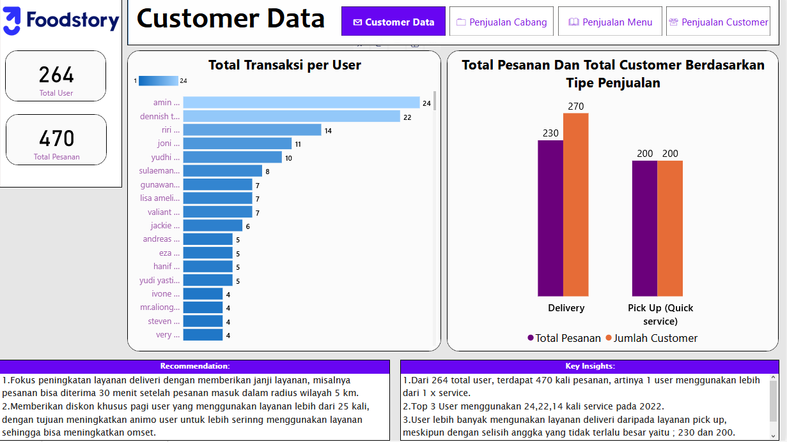
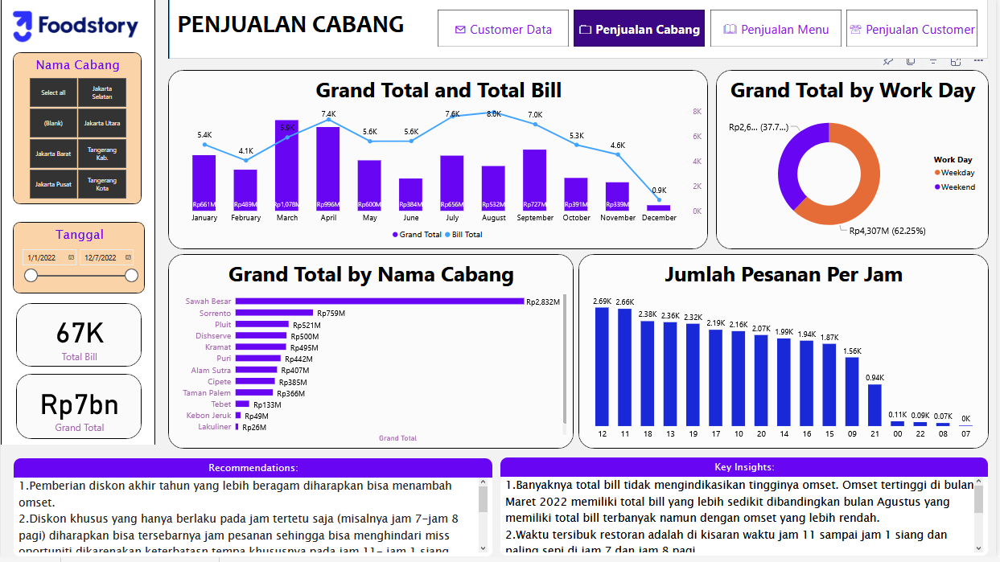
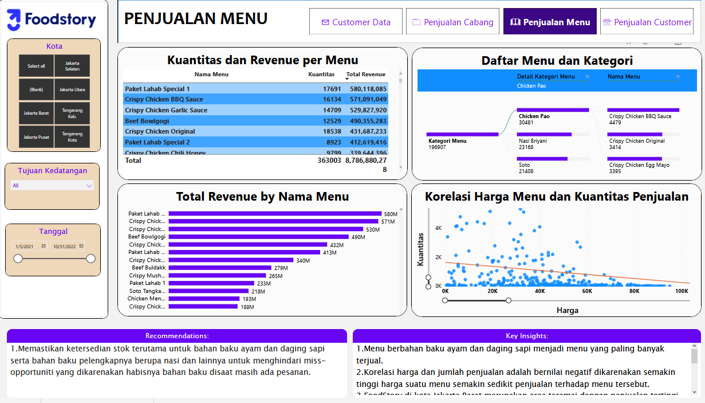

<h2> Food Story Dashboard </h2>

 URL Dashoboard project : <a href="https://app.powerbi.com/view?r=eyJrIjoiNDFjYWQ4MGMtOTNmNy00OTA1LTk4ZDgtNTMwOTYwM2FmYTc2IiwidCI6ImRmODY3OWNkLWE4MGUtNDVkOC05OWFjLWM4M2VkN2ZmOTVhMCJ9">Food Story</a>

<h3> Background Project :</h3>

Foodstory is a cloud kitchen industry that has several branches in Indonesia, especially in Jabodetabek, they want to increase their business 

<h3>Purpose:</h3>

to help Food Stories see their data more clearly, analyze their data, and provide insights and recommendations.

<h3>Dataset:</h3>

In this project, it used 4 csv files, customer data, sales report branch, sales report menu, and sales report customer, each file is data from 2022 to 2023 and must imported to microsoft power BI

<h3>Dashboard result:</h3>
<h4>Page Customer Data:</h4>

 
  

<h4>Page Sales Report Branch:</h4>

 
  

<h4>Page Sales Report Menu:</h4>

 
  

<h4>Page Sales Report Customer:</h4>

 
  

